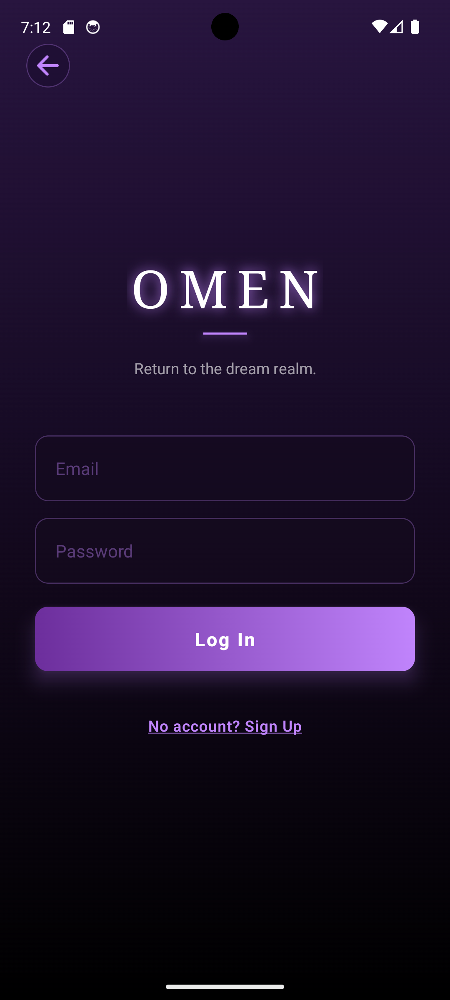
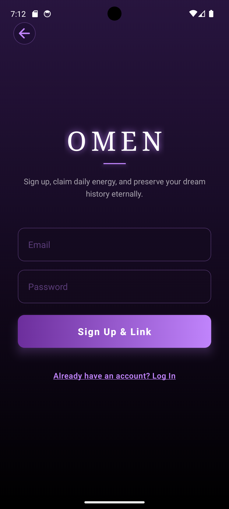
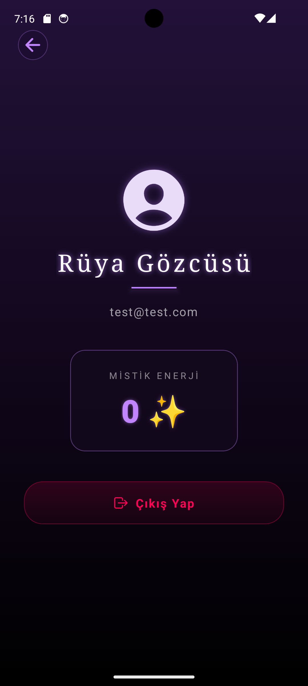

# 🔮 Omen - Yapay Zeka Destekli Rüya Analizi

Omen, kullanıcıların rüyalarını en ince ayrıntısına kadar analiz eden, bilinçaltının derinliklerindeki sembolleri ve mesajları ortaya çıkaran mistik temalı bir mobil uygulamadır. Gelişmiş yapay zeka (Gemini API) altyapısı kullanarak sıradan rüya tabirlerinin ötesine geçer ve kullanıcıya özel psikolojik/mistik okumalar sunar.

## ✨ Öne Çıkan Özellikler

* **Yapay Zeka ile Derin Analiz:** Kullanıcının girdiği rüya metinleri, Gemini API tarafından mistik bir kahin personasıyla analiz edilir.
* **Rüya Günlüğü:** Yapılan tüm analizler, kullanıcının geçmişe dönük inceleyebilmesi için güvenli bir şekilde bulutta (Firebase) saklanır.
* **Mistik Enerji Sistemi:** Kullanıcılar, rüya analizi ("Kehanet") alabilmek için enerji harcarlar. Enerji sistemi, AdMob ödüllü reklam entegrasyonu ile desteklenmektedir.
* **Baskın Duygu ve Arketip Tespiti:** Yapay zeka, rüyadaki temel duyguyu ve Jungiyen arketipleri (Örn: Bilge Yaşlı, Kendilik) tespit ederek etiketler.
* **Premium Karanlık Tema:** Gece uykusundan uyanan kullanıcıların gözünü yormayacak şekilde tasarlanmış pürüzsüz ve gizemli UI/UX tasarımı.

## 📱 Ekran Görüntüleri

  
   
  
  
  

> *Sırasıyla: Giriş/Kayıt Ekranı, Rüya Girişi & Kehanet Alma, Analiz Sonucu & Görselleştirme, Kullanıcı Profili & Enerji Yönetimi*

## 🛠 Kullanılan Teknolojiler (Tech Stack)

Bu proje, modern mobil geliştirme standartlarına uygun olarak inşa edilmiştir:

* **Frontend:** React Native, Expo
* **Backend / BaaS:** Firebase (Authentication, Cloud Firestore)
* **Yapay Zeka:** Google Gemini API
* **Monetizasyon:** Google AdMob (Ödüllü Reklamlar)
* **Analitik & Hata Takibi:** Firebase Crashlytics & Analytics

## 🚀 Kurulum ve Çalıştırma

Projeyi kendi yerel ortamınızda (local) çalıştırmak için aşağıdaki adımları izleyebilirsiniz:

### 1. Depoyu Klonlayın
`bash
git clone https://github.com/kadirshn/omen-app.git
cd omen-app
`

### 2. Bağımlılıkları Yükleyin
`bash
npm install
# veya
yarn install
`

### 3. Çevresel Değişkenleri (Environment Variables) Ayarlayın
Projenin kök dizininde bir `.env` dosyası oluşturun ve aşağıdaki anahtarları kendi projenize göre doldurun:
`env
EXPO_PUBLIC_FIREBASE_API_KEY=your_firebase_api_key
EXPO_PUBLIC_FIREBASE_AUTH_DOMAIN=your_firebase_auth_domain
EXPO_PUBLIC_FIREBASE_PROJECT_ID=your_firebase_project_id
EXPO_PUBLIC_FIREBASE_STORAGE_BUCKET=your_firebase_storage_bucket
EXPO_PUBLIC_FIREBASE_MESSAGING_SENDER_ID=your_sender_id
EXPO_PUBLIC_FIREBASE_APP_ID=your_app_id
EXPO_PUBLIC_GEMINI_API_KEY=your_gemini_api_key
EXPO_PUBLIC_ADMOB_AD_UNIT_ID=your_admob_unit_id
`

### 4. Uygulamayı Başlatın
`bash
npx expo start
`
*Bu komut sonrası açılan terminaldeki QR kodu okutarak Expo Go uygulaması üzerinden veya bilgisayarınızdaki Android/iOS emülatörleri ile projeyi çalıştırabilirsiniz.*

## 🔒 Güvenlik ve Mimari Notları

* Uygulama, Google Play inceleme süreçleri göz önünde bulundurularak geliştirilmiştir.
* AdMob reklamlarının yüklenemediği durumlarda (örn. test ortamları veya ağ kısıtlamaları), uygulama akışının kesilmemesi için **Fallback (B Planı)** mekanizmaları koda entegre edilmiştir.
* Gemini API istekleri, zaman aşımı ve format hatalarına karşı robust `try/catch` blokları ile korunmaktadır.

## 👨‍💻 Geliştirici

**Kadir Sahin** - Yazılım Mühendisi | React Native & .NET Geliştiricisi
