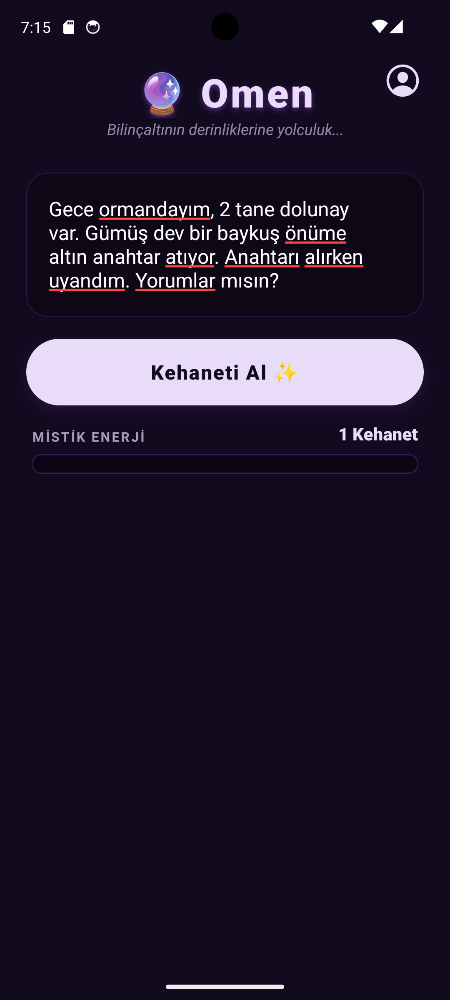
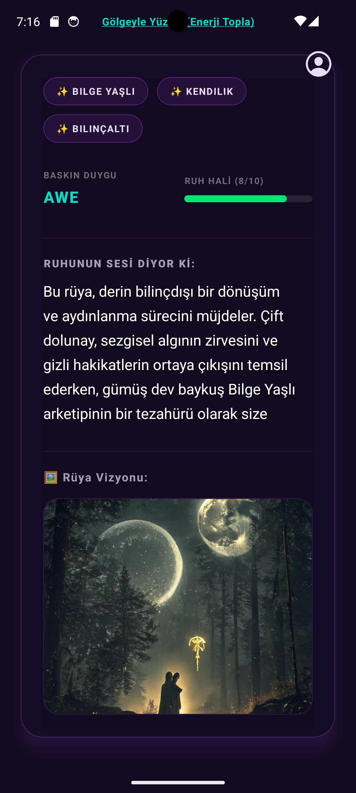
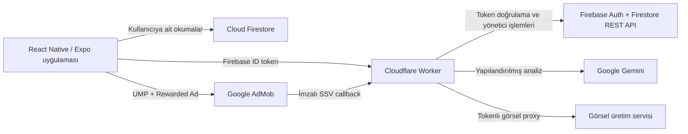

# 🔮 Omen — AI Destekli Rüya Günlüğü

Omen, kullanıcıların rüyalarını kaydetmesine, yapay zekâ destekli yorumlar almasına ve rüyalarından esinlenen özgün görseller oluşturmasına yardımcı olan Android odaklı bir mobil uygulamadır.

[](https://reactnative.dev/)
[](https://expo.dev/)
[](https://www.typescriptlang.org/)
[](https://workers.cloudflare.com/)
[](https://firebase.google.com/)

> [!IMPORTANT]
> Omen'in ürettiği içerikler eğlence ve kişisel farkındalık amaçlıdır. Uygulama tıbbi tanı, terapi, ruh sağlığı hizmeti veya kesin gelecek tahmini sunmaz.

## Uygulamadan görüntüler

<p align="center">
  
  &nbsp;&nbsp;
  
</p>

## Öne çıkan özellikler

- Misafir modunda anonim kullanım ve e-posta hesabına güvenli geçiş
- Google Gemini ile şema doğrulamalı rüya analizi
- Duygu, ruh hâli ve arketiplerin yapılandırılmış gösterimi
- Rüyadan esinlenen görsel üretimi ve güvenli görsel proxy'si
- Önceki rüyayı bağlama ekleyerek devamlılık sağlayan analiz akışı
- Rüya geçmişini görüntüleme ve kayıtları tek tek silme
- Uygulama içinden hesap ve ilişkili tüm verileri kalıcı olarak silme
- Uygunsuz veya hatalı AI çıktısını bildirme
- AdMob ödüllü reklamlar, UMP rıza yönetimi ve imzalı SSV doğrulaması
- Sunucu taraflı kredi ekonomisi, günlük ödül ve hız sınırlama
- Ağ hatası, zaman aşımı ve başarısız AI isteğinde güvenli kredi iadesi
- Türkçe ve İngilizce yerelleştirme altyapısı

## Mimari



Mobil istemci hiçbir zaman Gemini API anahtarına veya Firebase servis hesabına erişmez. Güven gerektiren işlemler Cloudflare Worker tarafından yürütülür.

### Analiz akışı

1. Firebase Authentication kullanıcıyı anonim veya e-posta hesabıyla doğrular.
2. Mobil uygulama Firebase ID token'ı ile Worker'a analiz isteği gönderir.
3. Worker token'ı doğrular, hız sınırını ve kredi durumunu kontrol eder.
4. Gemini çıktısı çalışma zamanında beklenen şemaya göre doğrulanır.
5. Görsel isteği, üretim prompt'unu açık URL'de göstermeyen süreli bir token üzerinden sunulur.
6. Başarılı sonuç kullanıcı geçmişine kaydedilir; AI hatasında harcanan kredi iade edilir.

### Ödüllü reklam akışı

AdMob ödülü mobil istemcinin beyanına güvenilerek verilmez. Google'ın gönderdiği SSV isteğinin ECDSA imzası Worker üzerinde doğrulanır. `transaction_id` tekilleştirilerek aynı reklam ödülünün birden fazla kez kullanılmasının önüne geçilir.

## Teknoloji yığını

| Katman | Teknolojiler |
| --- | --- |
| Mobil | React Native, Expo SDK 54, Expo Router, TypeScript |
| Arayüz | React Native Reanimated, Expo Haptics, i18next |
| Kimlik | Firebase Authentication — anonim ve e-posta/şifre |
| Veri | Cloud Firestore, güvenlik kuralları ve bileşik indeksler |
| Backend | Cloudflare Workers, TypeScript, Wrangler |
| Yapay zekâ | Google Gemini (`gemini-2.5-flash`) |
| Reklam | Google AdMob Rewarded Ads, UMP, SSV |
| Test ve kalite | TypeScript, ESLint, Vitest |
| Dağıtım | EAS Build, Android App Bundle, Google Play |

## Güvenlik ve gizlilik

- Secret değerler kaynak kodda ve mobil pakette tutulmaz.
- Worker, Firebase ID token'ını her korumalı istekte doğrular.
- Firestore kuralları kullanıcıyı yalnızca kendisine ait verilere sınırlar.
- Kredi güncellemeleri sunucu tarafında optimistic concurrency ile gerçekleştirilir.
- SSV imzası doğrulanmadan reklam ödülü verilmez.
- Tekrarlanan SSV işlemleri `transaction_id` ile engellenir.
- Görsel bağlantıları tahmin edilmesi zor, süreli token kullanır.
- Kullanıcı uygulama içinden tekil rüyalarını veya hesabıyla birlikte tüm verilerini silebilir.
- AI içerikleri şema ve güvenlik kontrollerinden geçirilir; kullanıcılar sonuçları bildirebilir.

Yayınlanan yasal sayfalar:

- [Gizlilik Politikası](https://omen-proxy.shnkadir.workers.dev/privacy)
- [Hesap ve Veri Silme](https://omen-proxy.shnkadir.workers.dev/delete-account)

## Proje yapısı

```text
.
├── app/                    # Expo Router ekranları ve rotalar
├── components/             # Yeniden kullanılabilir arayüz bileşenleri
├── context/                # Kimlik ve reklam bağlamları
├── hooks/                  # Kredi ve ödüllü reklam akışları
├── locales/                # Yerelleştirme dosyaları
├── utils/                  # Firebase ve Worker API istemcileri
├── cloudflare-worker/      # Güvenli backend, AI ve SSV uçları
├── firestore.rules         # Firestore erişim kuralları
├── firestore.indexes.json  # Firestore bileşik indeksleri
├── app.json                # Expo ve Android yapılandırması
└── eas.json                # EAS build profilleri
```

## Yerel geliştirme

### Gereksinimler

- Node.js 20+
- pnpm — Corepack üzerinden önerilir
- Android Studio ve Android SDK
- Firebase projesi
- Cloudflare hesabı
- Gemini API anahtarı

### Mobil uygulama

```powershell
corepack enable
pnpm install
Copy-Item .env.example .env
pnpm android
```

`.env` dosyasındaki `EXPO_PUBLIC_*` değerlerini kendi Firebase web uygulaması yapılandırmanızla doldurun. Bu dosyaya servis hesabı veya Gemini secret'ı eklemeyin.

### Cloudflare Worker

```powershell
Set-Location cloudflare-worker
pnpm install
Copy-Item .dev.vars.example .dev.vars
pnpm dev
```

Yerel Worker için gereken değişkenler:

```text
GEMINI_API_KEY
FIREBASE_API_KEY
FIREBASE_PROJECT_ID
FIREBASE_CLIENT_EMAIL
FIREBASE_PRIVATE_KEY
IMAGE_TOKEN_KEY
```

`ALLOW_INSECURE_REWARDS=true` yalnızca yerel test içindir ve production ortamında kesinlikle kullanılmamalıdır.

## Kalite kontrolleri

```powershell
pnpm typecheck
pnpm lint
pnpm --dir cloudflare-worker typecheck
pnpm --dir cloudflare-worker test
```

Worker testleri; AI yanıt şeması, istek doğrulama ve kritik yardımcı işlevleri kapsar.

## Dağıtım sırası

Production dağıtımında bağımlı güvenlik değişiklikleri nedeniyle sıra önemlidir:

1. Cloudflare Worker secret'larını tanımlayın ve Worker'ı deploy edin.
2. `/health`, `/privacy` ve `/delete-account` uçlarını doğrulayın.
3. Firestore kurallarını ve indekslerini deploy edin.
4. AdMob UMP mesajını yayımlayın ve SSV callback adresini tanımlayın.
5. EAS production AAB oluşturun ve Google Play'e yükleyin.

```powershell
pnpm --dir cloudflare-worker deploy
firebase deploy --only "firestore:rules,firestore:indexes"
eas build --platform android --profile production
```

Ayrıntılı yayın kontrol listesi için [PLAY_RELEASE_CHECKLIST.md](PLAY_RELEASE_CHECKLIST.md) dosyasına bakın.

## Paket kimliği

```text
com.kadirshn.omenn
```

---

Omen, React Native/Expo ile production odaklı mobil geliştirme; Firebase tabanlı kimlik ve veri yönetimi; Cloudflare Workers üzerinde güvenli serverless backend; üretken AI ve reklam doğrulama akışlarını tek projede bir araya getirir.
